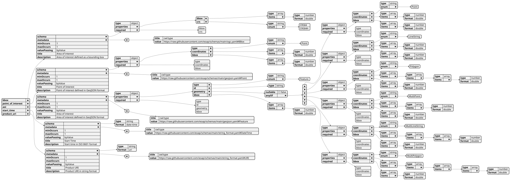
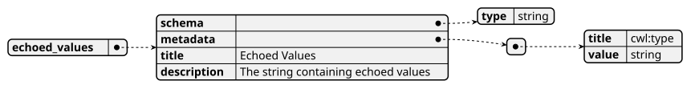
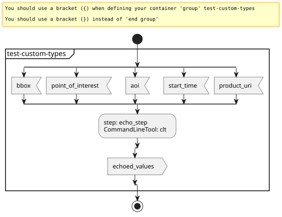
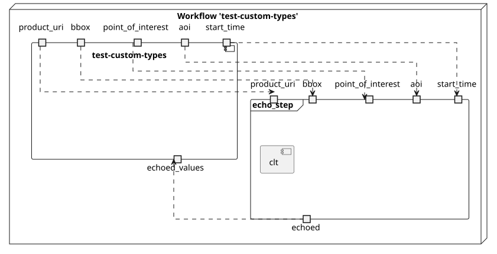
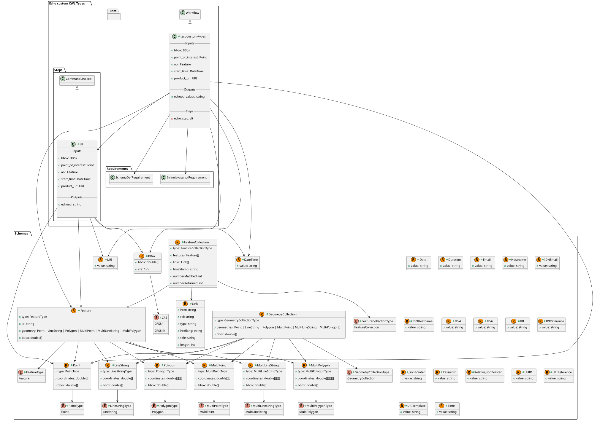
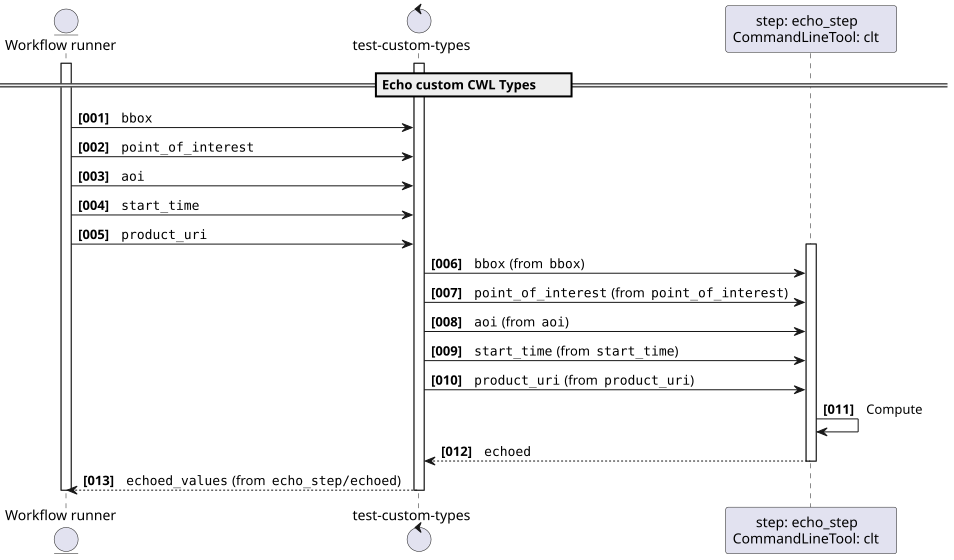
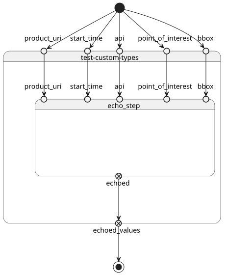

# Echo custom CWL Types v1.0.0

This workflow demonstrates usage of all CWL primitive types. It runs the `echo-tool` with default values and captures the output in a file.

> This software is licensed under the terms of the [Apache License 2.0](https://www.apache.org/licenses/LICENSE-2.0) license - SPDX short identifier: [Apache-2.0](https://spdx.org/licenses/Apache-2.0)
>
> 2025-01-01 - 2026-07-24T17:29:45.770 Copyright [Make Earth Observation Great Again](mailto:info@meoga.com) - > [https://ror.org/9999cx000](https://ror.org/9999cx000)

## Project Team

### Authors

| Name | Email | Organization | Role | Identifier |
|------|-------|--------------|------|------------|
| Lane, Lois | [lois.lane@dailyplanet.com](mailto:lois.lane@dailyplanet.com) | [Daily Planet](https://ror.org/0000cx000) | [Project Manager](http://purl.org/spar/datacite/ProjectManager) | [https://orcid.org/0000-9999-0000-9999](https://orcid.org/0000-9999-0000-9999) |
| Kent, Clark | [clark.kent@dailyplanet.com](mailto:clark.kent@dailyplanet.com) | [Daily Planet](https://ror.org/0000cx000) | [Researcher](http://purl.org/spar/datacite/Researcher) | [https://orcid.org/0000-9999-0000-9999](https://orcid.org/0000-9999-0000-9999) |


### Contributors

| Name | Email | Organization | Role | Identifier |
|------|-------|--------------|------|------------|
| Luthor, Lex | [lex.luthor@luthorcorp.com](mailto:lex.luthor@luthorcorp.com) | [Luthor Corp](https://ror.org/0000cx000) | []() | [https://orcid.org/0000-9999-0000-9999](https://orcid.org/0000-9999-0000-9999) |


## User Manual

User Manual can be found on [tps://eoap.github.io/application-package-patterns/](tps://eoap.github.io/application-package-patterns/).


## Runtime environment

### Supported Operating Systems

- Linux
- macOS

### Requirements

- [https://cwltool.readthedocs.io/en/latest/](https://cwltool.readthedocs.io/en/latest/)
- [https://www.python.org/](https://www.python.org/)


## Software Source code

- Browsable version of the [source repository](https://github.com/eoap/application-package-patterns.git);
- [Continuous integration](https://github.com/eoap/application-package-patterns/actions) system used by the project;
- Issues, bugs, and feature requests should be submitted to the following [issue management](https://github.com/eoap/application-package-patterns/issues) system for this project


---


## test-custom-types

### CWL Class

[Workflow](https://www.commonwl.org/v1.2/Workflow.html#Workflow)

### Requirements

* [InlineJavascriptRequirement](https://www.commonwl.org/v1.2/Workflow.html#InlineJavascriptRequirement)
* [SchemaDefRequirement](https://www.commonwl.org/v1.2/Workflow.html#SchemaDefRequirement)

### Inputs

| Id | Type | Label | Doc |
|----|------|-------|-----|
| `bbox` | [BBox](https://raw.githubusercontent.com/eoap/schemas/main/ogc.yaml#BBox):<ul><li>`bbox`: `array` of [double](https://www.commonwl.org/v1.2/Workflow.html#CWLType)</li><li>`crs`: [enum](https://www.commonwl.org/v1.2/Workflow.html#CommandInputEnumSchema):<ul><li>`CRS84`</li><li>`CRS84h`</li></ul></li></ul> | Area of interest | Area of interest defined as a bounding box |
| `point_of_interest` | [Point](https://raw.githubusercontent.com/eoap/schemas/main/geojson.yaml#Point):<ul><li>`type`: [enum](https://www.commonwl.org/v1.2/Workflow.html#CommandInputEnumSchema):<ul><li>`Point`</li></ul></li><li>`coordinates`: `array` of [double](https://www.commonwl.org/v1.2/Workflow.html#CWLType)</li><li>`bbox`: `array` of [double](https://www.commonwl.org/v1.2/Workflow.html#CWLType)</li></ul> | Point of Interest | Point of interest defined in GeoJSON format |
| `aoi` | [Feature](https://raw.githubusercontent.com/eoap/schemas/main/geojson.yaml#Feature):<ul><li>`type`: [enum](https://www.commonwl.org/v1.2/Workflow.html#CommandInputEnumSchema):<ul><li>`Feature`</li></ul></li><li>`id`: [string](https://www.commonwl.org/v1.2/Workflow.html#CWLType)</li><li>`geometry`: One of:<ul><li>[Point](https://raw.githubusercontent.com/eoap/schemas/main/geojson.yaml#Point):<ul><li>`type`: [enum](https://www.commonwl.org/v1.2/Workflow.html#CommandInputEnumSchema):<ul><li>`Point`</li></ul></li><li>`coordinates`: `array` of [double](https://www.commonwl.org/v1.2/Workflow.html#CWLType)</li><li>`bbox`: `array` of [double](https://www.commonwl.org/v1.2/Workflow.html#CWLType)</li></ul></li><li>[LineString](https://raw.githubusercontent.com/eoap/schemas/main/geojson.yaml#LineString):<ul><li>`type`: [enum](https://www.commonwl.org/v1.2/Workflow.html#CommandInputEnumSchema):<ul><li>`LineString`</li></ul></li><li>`coordinates`: `array` of [double](https://www.commonwl.org/v1.2/Workflow.html#CWLType)</li><li>`bbox`: `array` of [double](https://www.commonwl.org/v1.2/Workflow.html#CWLType)</li></ul></li><li>[Polygon](https://raw.githubusercontent.com/eoap/schemas/main/geojson.yaml#Polygon):<ul><li>`type`: [enum](https://www.commonwl.org/v1.2/Workflow.html#CommandInputEnumSchema):<ul><li>`Polygon`</li></ul></li><li>`coordinates`: `array` of `array` of `array` of [double](https://www.commonwl.org/v1.2/Workflow.html#CWLType)</li><li>`bbox`: `array` of [double](https://www.commonwl.org/v1.2/Workflow.html#CWLType)</li></ul></li><li>[MultiPoint](https://raw.githubusercontent.com/eoap/schemas/main/geojson.yaml#MultiPoint):<ul><li>`type`: [enum](https://www.commonwl.org/v1.2/Workflow.html#CommandInputEnumSchema):<ul><li>`MultiPoint`</li></ul></li><li>`coordinates`: `array` of `array` of [double](https://www.commonwl.org/v1.2/Workflow.html#CWLType)</li><li>`bbox`: `array` of [double](https://www.commonwl.org/v1.2/Workflow.html#CWLType)</li></ul></li><li>[MultiLineString](https://raw.githubusercontent.com/eoap/schemas/main/geojson.yaml#MultiLineString):<ul><li>`type`: [enum](https://www.commonwl.org/v1.2/Workflow.html#CommandInputEnumSchema):<ul><li>`MultiLineString`</li></ul></li><li>`coordinates`: `array` of `array` of `array` of [double](https://www.commonwl.org/v1.2/Workflow.html#CWLType)</li><li>`bbox`: `array` of [double](https://www.commonwl.org/v1.2/Workflow.html#CWLType)</li></ul></li><li>[MultiPolygon](https://raw.githubusercontent.com/eoap/schemas/main/geojson.yaml#MultiPolygon):<ul><li>`type`: [enum](https://www.commonwl.org/v1.2/Workflow.html#CommandInputEnumSchema):<ul><li>`MultiPolygon`</li></ul></li><li>`coordinates`: `array` of `array` of `array` of `array` of [double](https://www.commonwl.org/v1.2/Workflow.html#CWLType)</li><li>`bbox`: `array` of [double](https://www.commonwl.org/v1.2/Workflow.html#CWLType)</li></ul></li></ul></li><li>`bbox`: `array` of [double](https://www.commonwl.org/v1.2/Workflow.html#CWLType)</li></ul> | Area of interest | Area of interest defined in GeoJSON format |
| `start_time` | [DateTime](https://raw.githubusercontent.com/eoap/schemas/main/string_format.yaml#DateTime):<ul><li>`value`: [string](https://www.commonwl.org/v1.2/Workflow.html#CWLType)</li></ul> | Start Time | Start time in ISO 8601 format |
| `product_uri` | [URI](https://raw.githubusercontent.com/eoap/schemas/main/string_format.yaml#URI):<ul><li>`value`: [string](https://www.commonwl.org/v1.2/Workflow.html#CWLType)</li></ul> | Product URI | Product URI in string format |


### Steps

| Id | Runs | Label | Doc |
|----|------|-------|-----|
| [echo_step](#clt) | `#clt` | None | None |


### Outputs

| Id | Type | Label | Doc |
|----|------|-------|-----|
| `echoed_values` | [string](https://www.commonwl.org/v1.2/Workflow.html#CWLType) | Echoed Values | The string containing echoed values |


### OGC API - Processes

When `test-custom-types` [Workflow](https://www.commonwl.org/v1.2/Workflow.html#Workflow) is exposed through [OGC API - Processes - Part 1: Core](https://docs.ogc.org/is/18-062r2/18-062r2.html), `inputs` and `outputs` fields below represent the interface of the [getProcessDescription](https://developer.ogc.org/api/processes/index.html#tag/ProcessDescription/operation/getProcessDescription) API. 


#### Inputs



#### Outputs




### UML Diagrams


#### Activity diagram

Learn more about the [Activity diagram](https://en.wikipedia.org/wiki/Activity_diagram) below.



#### Component diagram

Learn more about the [Component diagram](https://en.wikipedia.org/wiki/Component_diagram) below.



#### Class diagram

Learn more about the [Class diagram](https://en.wikipedia.org/wiki/Class_diagram) below.



#### Sequence diagram

Learn more about the [Sequence diagram](https://en.wikipedia.org/wiki/Sequence_diagram) below.



#### State diagram

Learn more about the [State diagram](https://en.wikipedia.org/wiki/State_diagram) below.




### Run in step

`echo_step`


## clt

### CWL Class

[CommandLineTool](https://www.commonwl.org/v1.2/CommandLineTool.html#CommandLineTool)

### Inputs

| Id | Option | Type |
|----|------|-------|
| `bbox` | `--bbox` | [BBox](https://raw.githubusercontent.com/eoap/schemas/main/ogc.yaml#BBox):<ul><li>`bbox`: `array` of [double](https://www.commonwl.org/v1.2/Workflow.html#CWLType)</li><li>`crs`: [enum](https://www.commonwl.org/v1.2/Workflow.html#CommandInputEnumSchema):<ul><li>`CRS84`</li><li>`CRS84h`</li></ul></li></ul> |
| `point_of_interest` | `--point_of_interest` | [Point](https://raw.githubusercontent.com/eoap/schemas/main/geojson.yaml#Point):<ul><li>`type`: [enum](https://www.commonwl.org/v1.2/Workflow.html#CommandInputEnumSchema):<ul><li>`Point`</li></ul></li><li>`coordinates`: `array` of [double](https://www.commonwl.org/v1.2/Workflow.html#CWLType)</li><li>`bbox`: `array` of [double](https://www.commonwl.org/v1.2/Workflow.html#CWLType)</li></ul> |
| `aoi` | `--aoi` | [Feature](https://raw.githubusercontent.com/eoap/schemas/main/geojson.yaml#Feature):<ul><li>`type`: [enum](https://www.commonwl.org/v1.2/Workflow.html#CommandInputEnumSchema):<ul><li>`Feature`</li></ul></li><li>`id`: [string](https://www.commonwl.org/v1.2/Workflow.html#CWLType)</li><li>`geometry`: One of:<ul><li>[Point](https://raw.githubusercontent.com/eoap/schemas/main/geojson.yaml#Point):<ul><li>`type`: [enum](https://www.commonwl.org/v1.2/Workflow.html#CommandInputEnumSchema):<ul><li>`Point`</li></ul></li><li>`coordinates`: `array` of [double](https://www.commonwl.org/v1.2/Workflow.html#CWLType)</li><li>`bbox`: `array` of [double](https://www.commonwl.org/v1.2/Workflow.html#CWLType)</li></ul></li><li>[LineString](https://raw.githubusercontent.com/eoap/schemas/main/geojson.yaml#LineString):<ul><li>`type`: [enum](https://www.commonwl.org/v1.2/Workflow.html#CommandInputEnumSchema):<ul><li>`LineString`</li></ul></li><li>`coordinates`: `array` of [double](https://www.commonwl.org/v1.2/Workflow.html#CWLType)</li><li>`bbox`: `array` of [double](https://www.commonwl.org/v1.2/Workflow.html#CWLType)</li></ul></li><li>[Polygon](https://raw.githubusercontent.com/eoap/schemas/main/geojson.yaml#Polygon):<ul><li>`type`: [enum](https://www.commonwl.org/v1.2/Workflow.html#CommandInputEnumSchema):<ul><li>`Polygon`</li></ul></li><li>`coordinates`: `array` of `array` of `array` of [double](https://www.commonwl.org/v1.2/Workflow.html#CWLType)</li><li>`bbox`: `array` of [double](https://www.commonwl.org/v1.2/Workflow.html#CWLType)</li></ul></li><li>[MultiPoint](https://raw.githubusercontent.com/eoap/schemas/main/geojson.yaml#MultiPoint):<ul><li>`type`: [enum](https://www.commonwl.org/v1.2/Workflow.html#CommandInputEnumSchema):<ul><li>`MultiPoint`</li></ul></li><li>`coordinates`: `array` of `array` of [double](https://www.commonwl.org/v1.2/Workflow.html#CWLType)</li><li>`bbox`: `array` of [double](https://www.commonwl.org/v1.2/Workflow.html#CWLType)</li></ul></li><li>[MultiLineString](https://raw.githubusercontent.com/eoap/schemas/main/geojson.yaml#MultiLineString):<ul><li>`type`: [enum](https://www.commonwl.org/v1.2/Workflow.html#CommandInputEnumSchema):<ul><li>`MultiLineString`</li></ul></li><li>`coordinates`: `array` of `array` of `array` of [double](https://www.commonwl.org/v1.2/Workflow.html#CWLType)</li><li>`bbox`: `array` of [double](https://www.commonwl.org/v1.2/Workflow.html#CWLType)</li></ul></li><li>[MultiPolygon](https://raw.githubusercontent.com/eoap/schemas/main/geojson.yaml#MultiPolygon):<ul><li>`type`: [enum](https://www.commonwl.org/v1.2/Workflow.html#CommandInputEnumSchema):<ul><li>`MultiPolygon`</li></ul></li><li>`coordinates`: `array` of `array` of `array` of `array` of [double](https://www.commonwl.org/v1.2/Workflow.html#CWLType)</li><li>`bbox`: `array` of [double](https://www.commonwl.org/v1.2/Workflow.html#CWLType)</li></ul></li></ul></li><li>`bbox`: `array` of [double](https://www.commonwl.org/v1.2/Workflow.html#CWLType)</li></ul> |
| `start_time` | `--start_time` | [DateTime](https://raw.githubusercontent.com/eoap/schemas/main/string_format.yaml#DateTime):<ul><li>`value`: [string](https://www.commonwl.org/v1.2/Workflow.html#CWLType)</li></ul> |
| `product_uri` | `--product_uri` | [URI](https://raw.githubusercontent.com/eoap/schemas/main/string_format.yaml#URI):<ul><li>`value`: [string](https://www.commonwl.org/v1.2/Workflow.html#CWLType)</li></ul> |

### Execution usage example:

```
echo $(inputs.bbox) $(inputs.point_of_interest) $(inputs.aoi) $(inputs.start_time) $(inputs.product_uri) \
--bbox <BBOX> \
--point_of_interest <POINT_OF_INTEREST> \
--aoi <AOI> \
--start_time <START_TIME> \
--product_uri <PRODUCT_URI>
```

