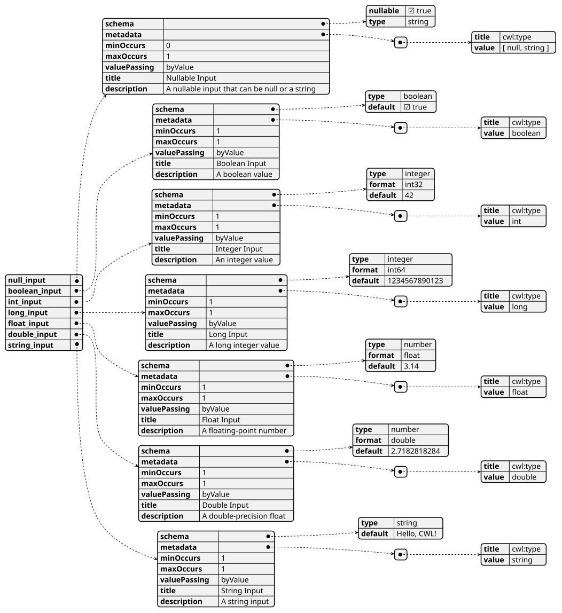
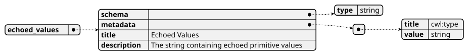
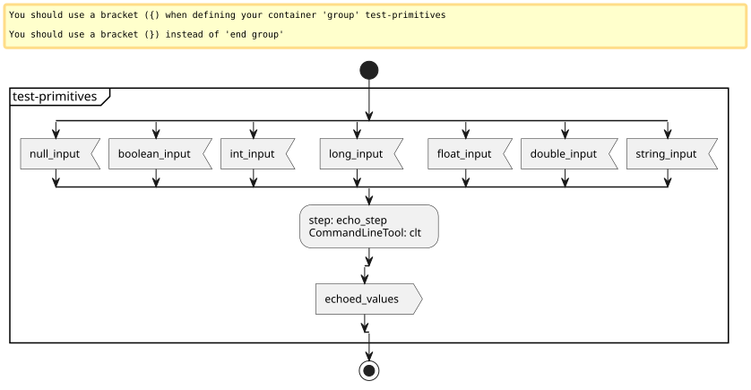
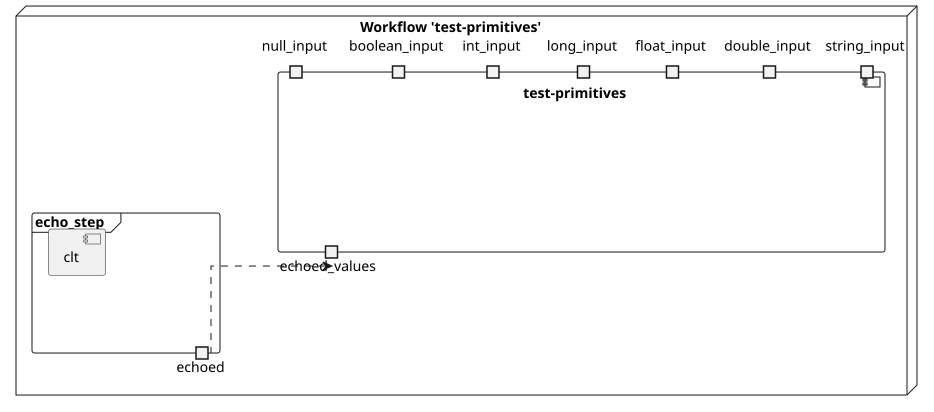
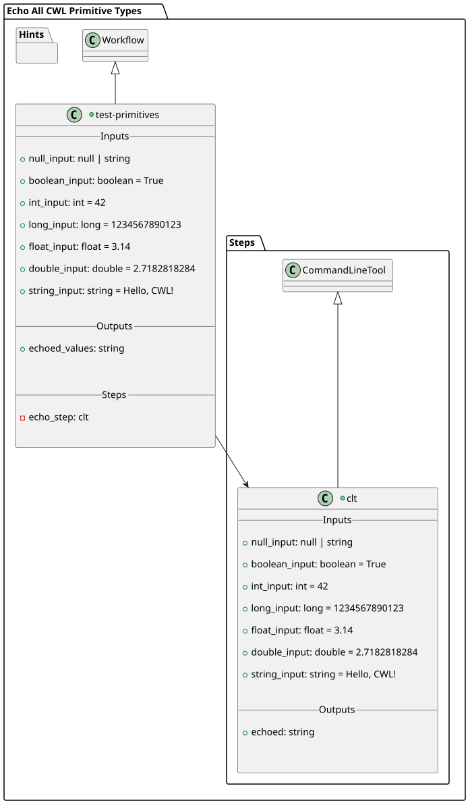
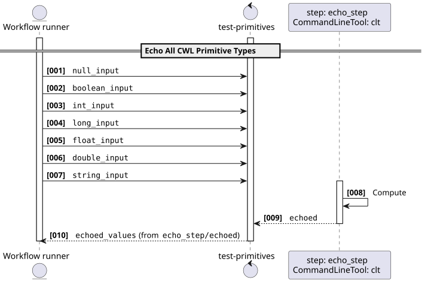
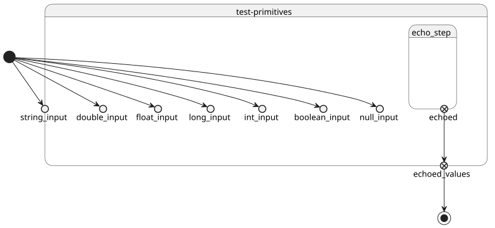

# Echo All CWL Primitive Types v1.0.0

This workflow demonstrates usage of all CWL primitive types. It runs the `echo-tool` with default values and captures the output in a file.

> This software is licensed under the terms of the [Apache License 2.0](https://www.apache.org/licenses/LICENSE-2.0) license - SPDX short identifier: [Apache-2.0](https://spdx.org/licenses/Apache-2.0)
>
> 2025-01-01 - 2026-07-24T17:29:59.275 Copyright [Make Earth Observation Great Again](mailto:info@meoga.com) - > [https://ror.org/9999cx000](https://ror.org/9999cx000)

## Project Team

### Authors

| Name | Email | Organization | Role | Identifier |
|------|-------|--------------|------|------------|
| Lane, Lois | [lois.lane@dailyplanet.com](mailto:lois.lane@dailyplanet.com) | [Daily Planet](https://ror.org/0000cx000) | [Project Manager](http://purl.org/spar/datacite/ProjectManager) | [https://orcid.org/0000-9999-0000-9999](https://orcid.org/0000-9999-0000-9999) |
| Kent, Clark | [clark.kent@dailyplanet.com](mailto:clark.kent@dailyplanet.com) | [Daily Planet](https://ror.org/0000cx000) | [Researcher](http://purl.org/spar/datacite/Researcher) | [https://orcid.org/0000-9999-0000-9999](https://orcid.org/0000-9999-0000-9999) |


### Contributors

| Name | Email | Organization | Role | Identifier |
|------|-------|--------------|------|------------|
| Luthor, Lex | [lex.luthor@luthorcorp.com](mailto:lex.luthor@luthorcorp.com) | [Luthor Corp](https://ror.org/0000cx000) | []() | [https://orcid.org/0000-9999-0000-9999](https://orcid.org/0000-9999-0000-9999) |


## User Manual

User Manual can be found on [tps://eoap.github.io/application-package-patterns/](tps://eoap.github.io/application-package-patterns/).


## Runtime environment

### Supported Operating Systems

- Linux
- macOS

### Requirements

- [https://cwltool.readthedocs.io/en/latest/](https://cwltool.readthedocs.io/en/latest/)
- [https://www.python.org/](https://www.python.org/)


## Software Source code

- Browsable version of the [source repository](https://github.com/eoap/application-package-patterns.git);
- [Continuous integration](https://github.com/eoap/application-package-patterns/actions) system used by the project;
- Issues, bugs, and feature requests should be submitted to the following [issue management](https://github.com/eoap/application-package-patterns/issues) system for this project


---


## test-primitives

### CWL Class

[Workflow](https://www.commonwl.org/v1.2/Workflow.html#Workflow)


### Inputs

| Id | Type | Label | Doc |
|----|------|-------|-----|
| `null_input` | One of:<ul><li>[null](https://www.commonwl.org/v1.2/Workflow.html#CWLType)</li><li>[string](https://www.commonwl.org/v1.2/Workflow.html#CWLType)</li></ul> | Nullable Input | A nullable input that can be null or a string |
| `boolean_input` | [boolean](https://www.commonwl.org/v1.2/Workflow.html#CWLType) | Boolean Input | A boolean value |
| `int_input` | [int](https://www.commonwl.org/v1.2/Workflow.html#CWLType) | Integer Input | An integer value |
| `long_input` | [long](https://www.commonwl.org/v1.2/Workflow.html#CWLType) | Long Input | A long integer value |
| `float_input` | [float](https://www.commonwl.org/v1.2/Workflow.html#CWLType) | Float Input | A floating-point number |
| `double_input` | [double](https://www.commonwl.org/v1.2/Workflow.html#CWLType) | Double Input | A double-precision float |
| `string_input` | [string](https://www.commonwl.org/v1.2/Workflow.html#CWLType) | String Input | A string input |


### Steps

| Id | Runs | Label | Doc |
|----|------|-------|-----|
| [echo_step](#clt) | `#clt` | None | None |


### Outputs

| Id | Type | Label | Doc |
|----|------|-------|-----|
| `echoed_values` | [string](https://www.commonwl.org/v1.2/Workflow.html#CWLType) | Echoed Values | The string containing echoed primitive values |


### OGC API - Processes

When `test-primitives` [Workflow](https://www.commonwl.org/v1.2/Workflow.html#Workflow) is exposed through [OGC API - Processes - Part 1: Core](https://docs.ogc.org/is/18-062r2/18-062r2.html), `inputs` and `outputs` fields below represent the interface of the [getProcessDescription](https://developer.ogc.org/api/processes/index.html#tag/ProcessDescription/operation/getProcessDescription) API. 


#### Inputs



#### Outputs




### UML Diagrams


#### Activity diagram

Learn more about the [Activity diagram](https://en.wikipedia.org/wiki/Activity_diagram) below.



#### Component diagram

Learn more about the [Component diagram](https://en.wikipedia.org/wiki/Component_diagram) below.



#### Class diagram

Learn more about the [Class diagram](https://en.wikipedia.org/wiki/Class_diagram) below.



#### Sequence diagram

Learn more about the [Sequence diagram](https://en.wikipedia.org/wiki/Sequence_diagram) below.



#### State diagram

Learn more about the [State diagram](https://en.wikipedia.org/wiki/State_diagram) below.




### Run in step

`echo_step`


## clt

### CWL Class

[CommandLineTool](https://www.commonwl.org/v1.2/CommandLineTool.html#CommandLineTool)

### Inputs

| Id | Option | Type |
|----|------|-------|
| `null_input` | `--null_input` | One of:<ul><li>[null](https://www.commonwl.org/v1.2/Workflow.html#CWLType)</li><li>[string](https://www.commonwl.org/v1.2/Workflow.html#CWLType)</li></ul> |
| `boolean_input` | `--boolean_input` | [boolean](https://www.commonwl.org/v1.2/Workflow.html#CWLType) |
| `int_input` | `--int_input` | [int](https://www.commonwl.org/v1.2/Workflow.html#CWLType) |
| `long_input` | `--long_input` | [long](https://www.commonwl.org/v1.2/Workflow.html#CWLType) |
| `float_input` | `--float_input` | [float](https://www.commonwl.org/v1.2/Workflow.html#CWLType) |
| `double_input` | `--double_input` | [double](https://www.commonwl.org/v1.2/Workflow.html#CWLType) |
| `string_input` | `--string_input` | [string](https://www.commonwl.org/v1.2/Workflow.html#CWLType) |

### Execution usage example:

```
echo $(inputs.null_input) $(inputs.boolean_input) $(inputs.int_input) $(inputs.long_input) $(inputs.float_input) $(inputs.double_input) $(inputs.string_input) \
(--null_input <NULL_INPUT>) \
--boolean_input <BOOLEAN_INPUT> \
--int_input <INT_INPUT> \
--long_input <LONG_INPUT> \
--float_input <FLOAT_INPUT> \
--double_input <DOUBLE_INPUT> \
--string_input <STRING_INPUT>
```

