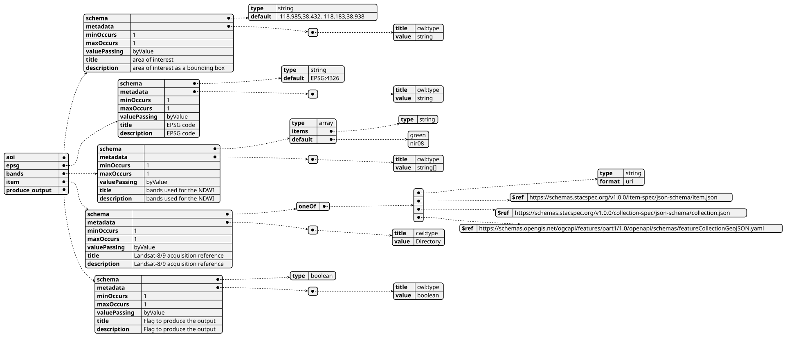
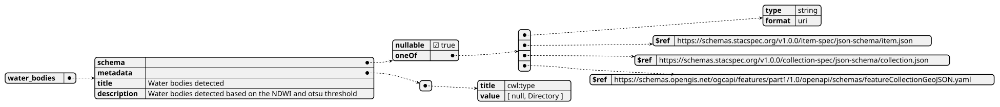
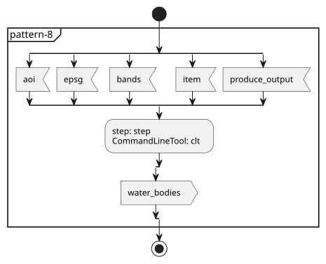
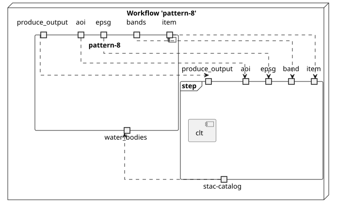
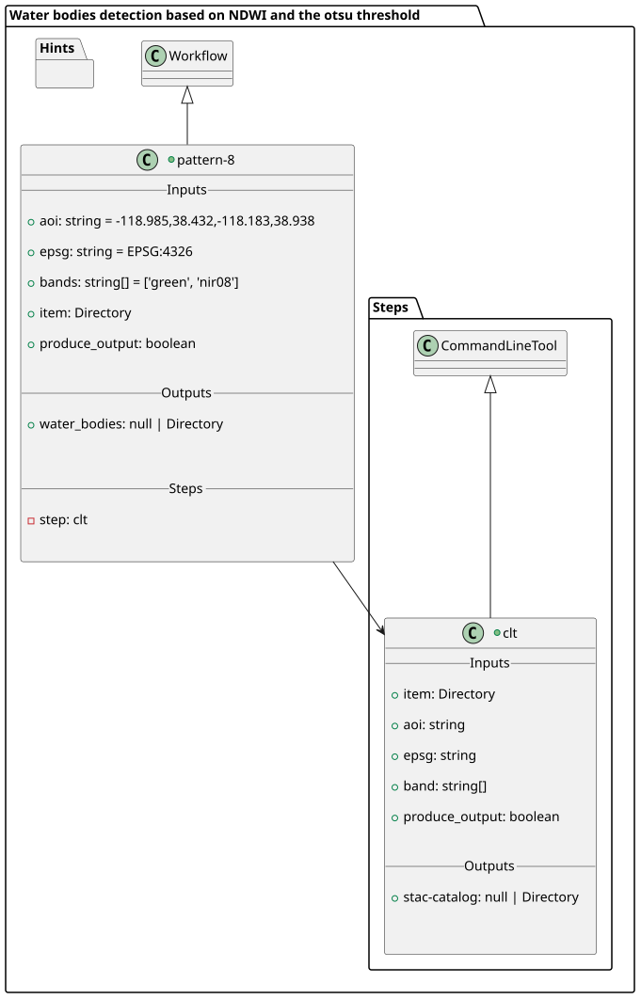
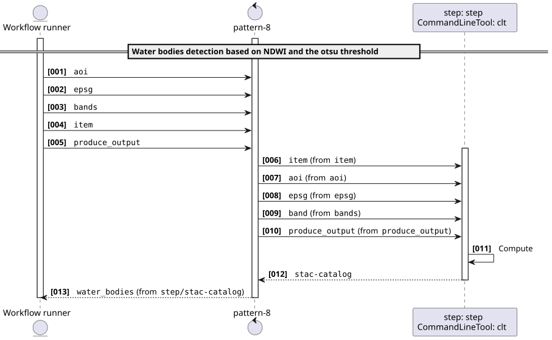
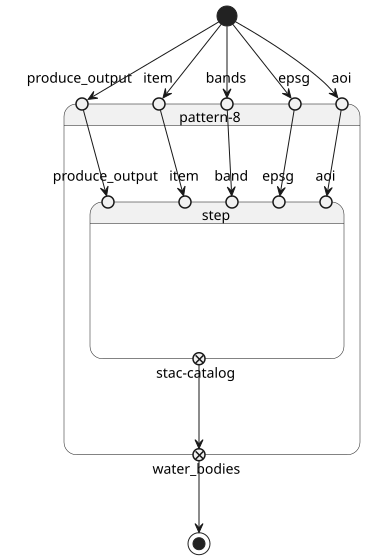

# Pattern 8 - Water bodies detection based on NDWI and the otsu threshold v1.0.0

* one input parameter of type `Directory`
* one output parameter of type `Directory?`

This scenario takes as input an acquisition, applies an algorithm and may or may not generate and output

Implementation: detects water bodies using the Normalized Difference Water Index (NDWI) and Otsu thresholding.


> This software is licensed under the terms of the [Apache License 2.0](https://spdx.org/licenses/Apache-2.0.html) license - SPDX short identifier: [Apache-2.0](https://spdx.org/licenses/Apache-2.0)
>
> 2025-01-01 - 2026-08-28T13:26:55.260 Copyright [Make Earth Observation Great Again](mailto:info@meoga.com) - > [https://ror.org/9999cx000](https://ror.org/9999cx000)

## Project Team

### Authors

| Name | Email | Organization | Role | Identifier |
|------|-------|--------------|------|------------|
| Lane, Lois | [lois.lane@meoga.com](mailto:lois.lane@meoga.com) | [Make Earth Observation Great Again](https://ror.org/9999cx000) | [Project administration](https://credit.niso.org/contributor-roles/project-administration/) | [https://orcid.org/0000-9999-0000-9999](https://orcid.org/0000-9999-0000-9999) |
| Kent, Clark | [clark.kent@meoga.com](mailto:clark.kent@meoga.com) | [Make Earth Observation Great Again](https://ror.org/9999cx000) | [Supervision](https://credit.niso.org/contributor-roles/supervision/) | [https://orcid.org/9999-0000-9999-0000](https://orcid.org/9999-0000-9999-0000) |


### Contributors

| Name | Email | Organization | Role | Identifier |
|------|-------|--------------|------|------------|
| Luthor, Lex | [lex.luthor@meoga.com](mailto:lex.luthor@meoga.com) | [Make Earth Observation Great Again](https://ror.org/9999cx000) | [Software](https://credit.niso.org/contributor-roles/software/) | [None](None) |


## User Manual

User Manual can be found on [https://eoap.github.io/application-package-patterns/pattern-1/](https://eoap.github.io/application-package-patterns/pattern-1/).


## Runtime environment

### Supported Operating Systems

- Linux
- macOS
- macOS Server

### Requirements

- [https://cwltool.readthedocs.io/en/latest/](https://cwltool.readthedocs.io/en/latest/)
- [https://www.python.org/](https://www.python.org/)


---


## pattern-8

### CWL Class

[Workflow](https://www.commonwl.org/v1.2/Workflow.html#Workflow)


### Inputs

| Id | Type | Label | Doc |
|----|------|-------|-----|
| `aoi` | [string](https://www.commonwl.org/v1.2/Workflow.html#CWLType) | area of interest | area of interest as a bounding box |
| `epsg` | [string](https://www.commonwl.org/v1.2/Workflow.html#CWLType) | EPSG code | EPSG code |
| `bands` | `array` of [string](https://www.commonwl.org/v1.2/Workflow.html#CWLType) | bands used for the NDWI | bands used for the NDWI |
| `item` | [Directory](https://www.commonwl.org/v1.2/Workflow.html#Directory) | Landsat-8/9 acquisition reference | Landsat-8/9 acquisition reference |
| `produce_output` | [boolean](https://www.commonwl.org/v1.2/Workflow.html#CWLType) | Flag to produce the output | Flag to produce the output |


### Steps

| Id | Runs | Label | Doc |
|----|------|-------|-----|
| [step](#clt) | `#clt` | Detect water bodies | Detect water bodies based on the NDWI and otsu threshold from Landsat-8/9 acquisition |


### Outputs

| Id | Type | Label | Doc |
|----|------|-------|-----|
| `water_bodies` | One of:<ul><li>[null](https://www.commonwl.org/v1.2/Workflow.html#CWLType)</li><li>[Directory](https://www.commonwl.org/v1.2/Workflow.html#Directory)</li></ul> | Water bodies detected | Water bodies detected based on the NDWI and otsu threshold |


### OGC API - Processes

When `pattern-8` [Workflow](https://www.commonwl.org/v1.2/Workflow.html#Workflow) is exposed through [OGC API - Processes - Part 1: Core](https://docs.ogc.org/is/18-062r2/18-062r2.html), `inputs` and `outputs` fields below represent the interface of the [getProcessDescription](https://developer.ogc.org/api/processes/index.html#tag/ProcessDescription/operation/getProcessDescription) API. 


#### Inputs



#### Outputs




### UML Diagrams


#### Activity diagram

Learn more about the [Activity diagram](https://en.wikipedia.org/wiki/Activity_diagram) below.



#### Component diagram

Learn more about the [Component diagram](https://en.wikipedia.org/wiki/Component_diagram) below.



#### Class diagram

Learn more about the [Class diagram](https://en.wikipedia.org/wiki/Class_diagram) below.



#### Sequence diagram

Learn more about the [Sequence diagram](https://en.wikipedia.org/wiki/Sequence_diagram) below.



#### State diagram

Learn more about the [State diagram](https://en.wikipedia.org/wiki/State_diagram) below.




### Run in step

`step`


## clt

### CWL Class

[CommandLineTool](https://www.commonwl.org/v1.2/CommandLineTool.html#CommandLineTool)

### Inputs

| Id | Option | Type |
|----|------|-------|
| `item` | `--input-item` | [Directory](https://www.commonwl.org/v1.2/Workflow.html#Directory) |
| `aoi` | `--aoi` | [string](https://www.commonwl.org/v1.2/Workflow.html#CWLType) |
| `epsg` | `--epsg` | [string](https://www.commonwl.org/v1.2/Workflow.html#CWLType) |
| `band` | `--band` | One of:<ul><li>`array` of [string](https://www.commonwl.org/v1.2/Workflow.html#CWLType)</li></ul> |
| `produce_output` | `--produce_output` | [boolean](https://www.commonwl.org/v1.2/Workflow.html#CWLType) |

### Execution usage example:

```
runner pattern-8 <ARGUMENT_DYNAMICALLY_SET> \
--input-item <ITEM> \
--aoi <AOI> \
--epsg <EPSG> \
--band <BAND> \
--produce_output <PRODUCE_OUTPUT>
```

